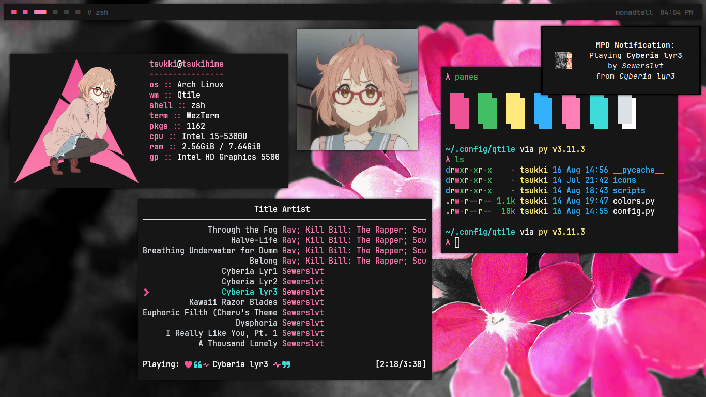
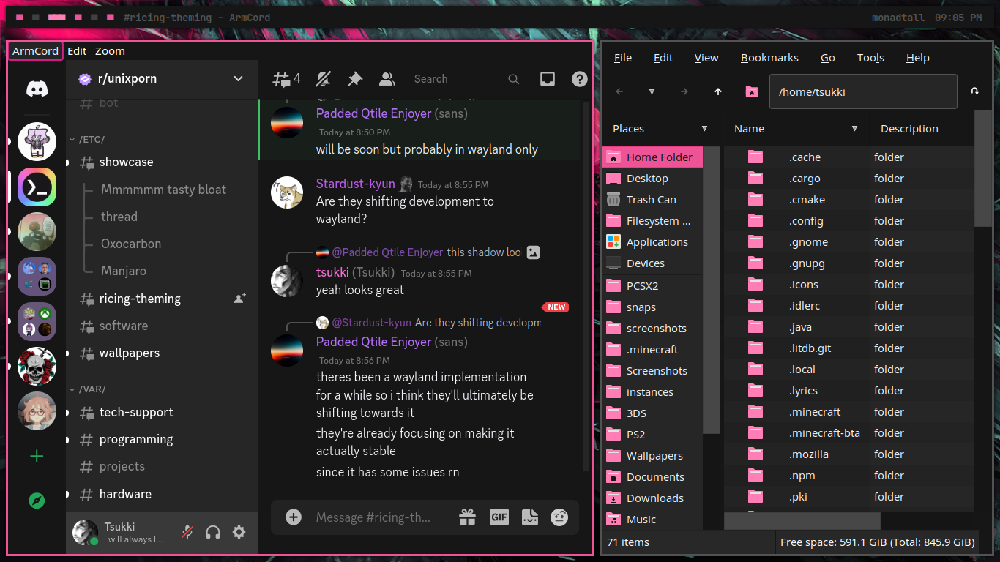
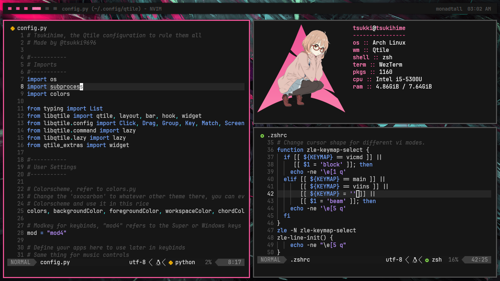
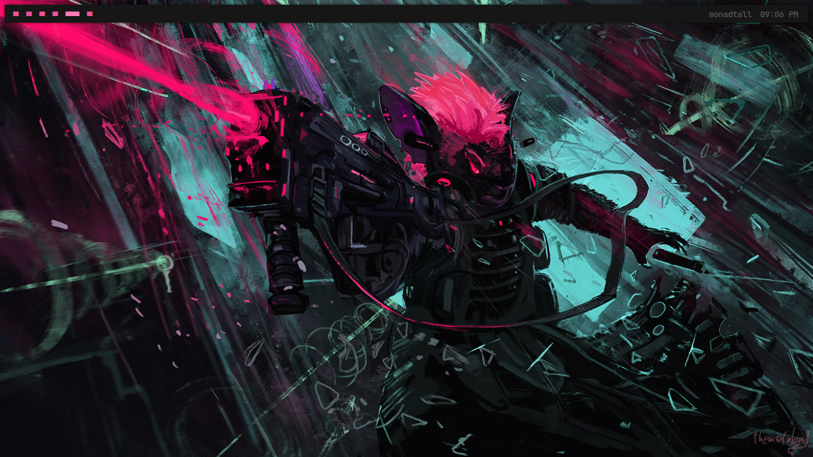

This is my dotfiles repository containing my current qtile config, feel free to take inspiration from it or even use some of my configs.

- **window manager**: qtile
- **terminal**: wezterm
- **text editor**: nvim
- **file manager**: pcmanfm
- **shell**: zsh
- **music player**: ncmpcpp

---

### TODO
- Add a better, revised list of dependencies
- Colorscheme switching script, including a way to change wallpapers and GTK themes on the fly
- A way to swap between multiple bar designs
- Better documentation

---

Tsukihime comes with simple, but sensible defaults and features, such as **scratchpads**, **ease of switching out app shortcuts**, **various colorschemes**, **easy to switch keybinds and different visual elements** and another functionalities expected from a tiling window manager.

---

### Dependencies 
I have a script that install most dependencies for this setup. This script also will install `yay` and has a prompt for cloning my wallpapers repository. This is not guaranteed to work on every machine but the script is simple enough, it should make most of the basic functionality. You are encouraged to tinker with the script and add what you want to be installed, this is intended to work on Arch based systems, since it downloads Arch and AUR packages.

---

### Gallery

<b>Programs</b>

### GTK

### Terminal

### Wallpaper

